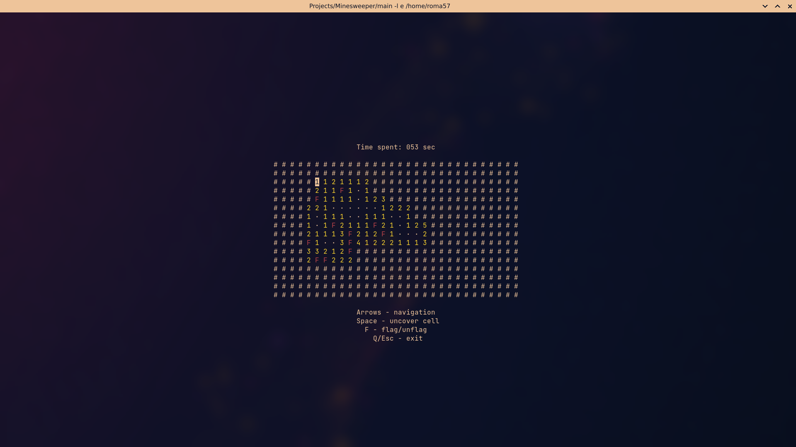

# Minesweeper
Simple crossplaform TUI-based minesweeper clone written in [Nim](https://nim-lang.org).
## Build
```
nimble build
```
Produce `build/main` executable.
## Run
```
nimble run
```
Adding `-d:release` makes produced executable faster.
## Screenshots

